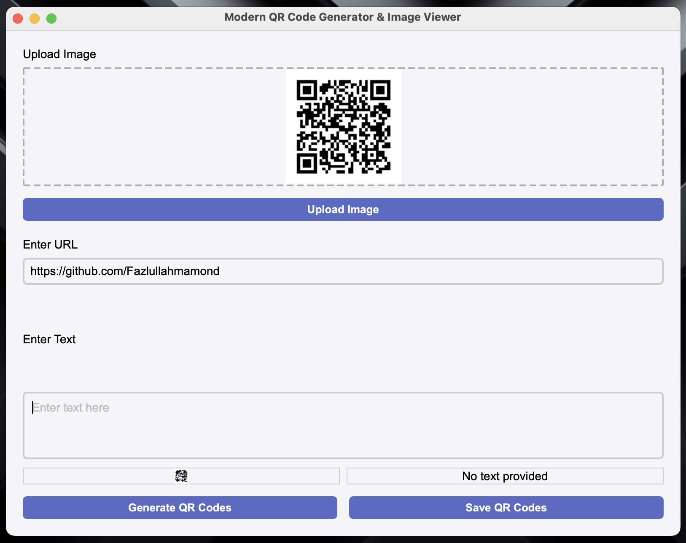

QR Code Generator & Image Viewer



A modern, cross-platform desktop application built with Python, PyQt6, qrcode, and Pillow (PIL) that allows users to:

- Upload and display images.
- Enter a URL and/or text.
- Generate QR codes for the URL and text.
- Save QR codes as PNG images.

The app features a modern, responsive user interface, error handling for invalid inputs, and works on Windows, macOS, and Linux.

## Features

- **Upload Image**: Select image files to display in the app.
- **Generate QR Codes**: Create QR codes from URLs and text.
- **Save QR Codes**: Save generated QR codes as PNG images.
- **Modern UI**: Clean, responsive interface with stylish buttons, input fields, and layouts.
- **Error Handling**: Alerts users for missing inputs or invalid operations.

## Installation

Clone the repository:

```bash
git clone https://github.com/yourusername/qr-code-generator.git
cd qr-code-generator
```

Install dependencies (requires Python 3.9+):

```bash
pip install PyQt6 qrcode pillow
```

## Usage

Run the application with:

```bash
python app.py
```

### Steps

1. Click "Upload Image" to select and display an image.
2. Enter a URL and/or text in the input fields.
3. Click "Generate QR Codes" to create QR codes for your input.
4. Click "Save QR Codes" to save them as PNG files.

## Dependencies

- **PyQt6** – for the GUI.
- **qrcode** – for QR code generation.
- **Pillow** – for image processing.

## Code Structure

- `app.py` – Main application code.
- Modular functions for:
  - Image upload and display
  - QR code generation
  - Saving QR codes
  - Converting PIL images to QPixmap for PyQt6 display

## Contributing

Contributions are welcome to improve UI/UX, add features, or optimize functionality.

### Typical workflow

1. Fork the repository.
2. Create a branch: `git checkout -b feature-name`.
3. Make changes and commit: `git commit -m "Add new feature"`.
4. Push to your branch: `git push origin feature-name`.
5. Open a Pull Request.

## License

MIT License.

## Acknowledgements

- PyQt6 for GUI framework.
- qrcode for QR code generation.
- Pillow for image processing.
